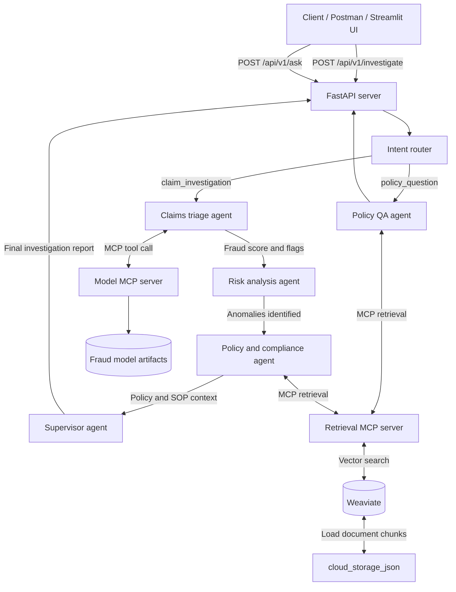

# Agentic Insurance Fraud Risk and Investigation System

A multi-agent insurance workflow that combines a fraud-risk model, LangGraph orchestration, policy retrieval with Weaviate, MCP services, FastAPI, and a Streamlit investigation desk.

## Architecture and System Flow



## Prerequisites

- Python 3.10 or newer
- Docker and Docker Compose
- Ollama with the configured model available locally
- An Ollama model such as `llama3.1`

## Setup

From the project root:

```bash
python3 -m venv .venv
source .venv/bin/activate
python -m pip install --upgrade pip
python -m pip install -r requirements.txt
```

Start Weaviate:

```bash
docker compose up -d weaviate
```

Make sure Ollama is running and pull the default model if needed:

```bash
ollama serve
ollama pull llama3.1
```

Build and index the policy knowledge base:

```bash
python build_knowledge_base.py
python index_to_weaviate.py
```

## Run the Application

Open two terminals from the project root. Activate `.venv` in each terminal.

Terminal 1, start the API:

```bash
uvicorn api_server:app --host 0.0.0.0 --port 8001 --reload
```

Terminal 2, start the Streamlit UI:

```bash
streamlit run streamlit_app.py
```

Open the Streamlit URL shown in the terminal, usually `http://localhost:8501`. The API health endpoint is available at `http://localhost:8001/health`.

## Configuration

The following environment variables are optional:

```bash
export OLLAMA_HOST=http://localhost:11434
export OLLAMA_MODEL=llama3.1
export API_URL=http://localhost:8001
```

## Tests

With the virtual environment active:

```bash
python -m pytest tests
```

The `tests/` directory is ignored by Git in this local project. If it was previously tracked, remove it from the index while retaining the files locally:

```bash
git rm -r --cached tests/
```