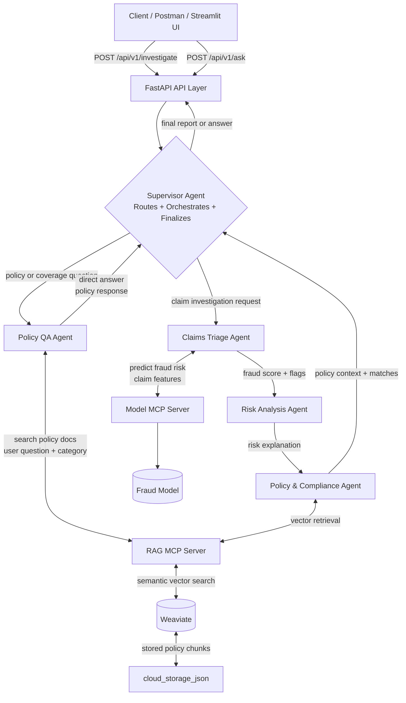

# Agentic Insurance Fraud Risk and Investigation System

A supervisor-led multi-agent insurance workflow that combines a fraud-risk model, LangGraph orchestration, policy retrieval with Weaviate, MCP services, FastAPI, and a Streamlit investigation desk.

## Architecture and System Flow

This system follows a **supervisor-led multi-agent design**. A single supervisor agent owns the workflow from start to finish:

1. It decides whether the request is a fraud investigation or a policy question.
2. It routes the request to the correct specialist.
3. It aggregates the evidence returned by specialist agents.
4. It finalizes the answer as either:
   - a direct policy response, or
   - a fraud investigation summary report.



### Notes on the architecture

- The supervisor is the only routing decision point. It does not create a separate intent-router layer.
- The workflow is intentionally split into two paths:
  - Policy QA path: the user asks a coverage or policy question and receives a direct answer.
  - Claims investigation path: the user submits a claim for fraud assessment, risk explanation, and policy review.
- The graph is phase-driven and terminates explicitly so it does not loop indefinitely.

### Agent responsibilities, inputs, and response format

#### 1) Supervisor Agent
- Role: decides the route and final output
- Inputs:
  - `user_query` for policy questions
  - `claim_id` and `raw_claim_data` for claim investigations
- Output:
  - `route`: `policy_qa` or `claims_triage`
  - `phase`: routing / finalization state
  - final answer or report
- Response type:
  - direct answer for policy questions
  - synthesized fraud investigation report for claims

#### 2) Policy QA Agent
- Role: answers policy questions using retrieved policy knowledge
- Inputs:
  - `user_query`
  - optional category like `Auto`, `Health`, `Property`
- Output:
  - `policy_answer`
  - `retrieved_policies`
  - `phase = "finalize"`
- Response type:
  - concise natural-language answer grounded in policy context

#### 3) Claims Triage Agent
- Role: runs the fraud model and extracts claim risk signals
- Inputs:
  - `claim_id`
  - `raw_claim_data` containing claim features such as amount, claim type, tenure, peer deviation, provider ID, etc.
- Output:
  - `fraud_score`
  - `risk_level`
  - `triage_action`
  - `risk_signals`
  - `phase = "risk_analysis"`
- Response type:
  - structured fraud triage payload

#### 4) Risk Analysis Agent
- Role: interprets why the claim was flagged and explains suspicious patterns
- Inputs:
  - fraud model result
  - risk signals from triage
  - raw claim details
- Output:
  - `risk_analysis_summary`
  - `phase = "policy_check"`
- Response type:
  - human-readable risk explanation

#### 5) Policy & Compliance Agent
- Role: retrieves matching policy or case context to support the investigation
- Inputs:
  - risk summary
  - user/claim context
  - relevant claim or policy keywords
- Output:
  - `retrieved_policies`
  - policy context references for the final report
- Response type:
  - ranked policy / case document matches with metadata and excerpts

#### 6) FastAPI Layer
- Role: exposes endpoints to clients and orchestrates streaming graph execution
- Inputs:
  - `POST /api/v1/investigate` with claim payload
  - `POST /api/v1/ask` with user question
- Output:
  - API JSON payload with status, structured findings, and final answer/report
- Response type:
  - JSON, including either a fraud report or a direct policy answer

## Prerequisites

- Python 3.10 or newer
- Docker and Docker Compose
- Ollama with the configured model available locally
- An Ollama model such as `llama3.1`

## Setup

From the project root:

```bash
python3 -m venv .venv
source .venv/bin/activate
python -m pip install --upgrade pip
python -m pip install -r requirements.txt
```

Start Weaviate:

```bash
docker compose up -d weaviate
```

Make sure Ollama is running and pull the default model if needed:

```bash
ollama serve
ollama pull llama3.1
```

Build and index the policy knowledge base:

```bash
python build_knowledge_base.py
python index_to_weaviate.py
```

## Run the Application

Open two terminals from the project root. Activate `.venv` in each terminal.

Terminal 1, start the API:

```bash
uvicorn api_server:app --host 0.0.0.0 --port 8001 --reload
```

Terminal 2, start the Streamlit UI:

```bash
streamlit run streamlit_app.py
```

Open the Streamlit URL shown in the terminal, usually `http://localhost:8501`. The API health endpoint is available at `http://localhost:8001/health`.

## Configuration

The following environment variables are optional:

```bash
export OLLAMA_HOST=http://localhost:11434
export OLLAMA_MODEL=llama3.1
export API_URL=http://localhost:8001
```

## API Endpoints

### `/health` (GET)
Health check for the API.

**Response:**
```json
{
  "status": "healthy",
  "service": "Insurance Multi-Agent Flow"
}
```

### `/api/v1/investigate` (POST)
Trigger a claim fraud investigation.

**Request Body:**
```json
{
  "claim_id": "CLM_12345",
  "raw_claim_data": {
    "claim_amount": 8000.0,
    "claim_type": "Property",
    "customer_tenure": 48,
    "claims_last_12m": 1,
    "avg_hist_claim": 3000.0,
    "provider_id": "PRV_121",
    "geography": "Urban",
    "submission_delay": 25,
    "previously_rejected_claims": 0,
    "deviation_from_peer_claims": 4000.0
  }
}
```

**Response:**
```json
{
  "status": "success",
  "claim_id": "CLM_12345",
  "triage": {
    "fraud_score": 0.42,
    "risk_level": "MEDIUM",
    "triage_action": "REQUEST_FURTHER_DOCUMENTATION",
    "signals": { "peer_deviation_flag": true }
  },
  "risk_analysis": "Analysis summary...",
  "policy_matches": [{"doc_id": "...", "title": "...", "content": "..."}],
  "final_report": "Fraud Investigation Report..."
}
```

### `/api/v1/ask` (POST)
Ask a policy or coverage question.

**Request Body:**
```json
{
  "question": "What is covered under auto policy for collision damage?",
  "category": "Auto"
}
```

**Response:**
```json
{
  "status": "success",
  "question": "What is covered...",
  "policy_matches": [...],
  "answer": "Collision coverage typically..."
}
```

## Tests

With the virtual environment active:

```bash
python -m pytest tests
```

## System Components

- **Supervisor Agent**: Single decision point; routes to specialists and finalizes output
- **Claims Triage Agent**: Calls fraud model MCP server; scores claim risk
- **Risk Analysis Agent**: LLM-based analysis of fraud signals
- **Policy & Compliance Agent**: RAG retrieval of policy context
- **Policy QA Agent**: Direct policy question answering via RAG
- **Model MCP Server** (`mcp_model_server.py`): Exposes fraud prediction model
- **RAG MCP Server** (`mcp_rag_server.py`): Exposes Weaviate policy retrieval
- **Weaviate**: Vector store for policy and case documents
- **FastAPI**: REST endpoints for investigation and QA
- **Streamlit**: Web UI for investigator desk

## Key Features

✅ **Single Supervisor Agent**: No intent router; one agent decides routing and finalizes all outputs  
✅ **Phase-Based Termination**: Explicit `phase = "done"` prevents infinite loops  
✅ **Clean Route Clearing**: Route state is cleared after each specialist completes  
✅ **Separate Flows**: Policy QA returns direct answers; fraud investigations return full investigation reports  
✅ **MCP Tool Integration**: Fraud model and policy retrieval exposed via FastMCP  
✅ **RAG Context**: Policies and case history inform investigation recommendations  
