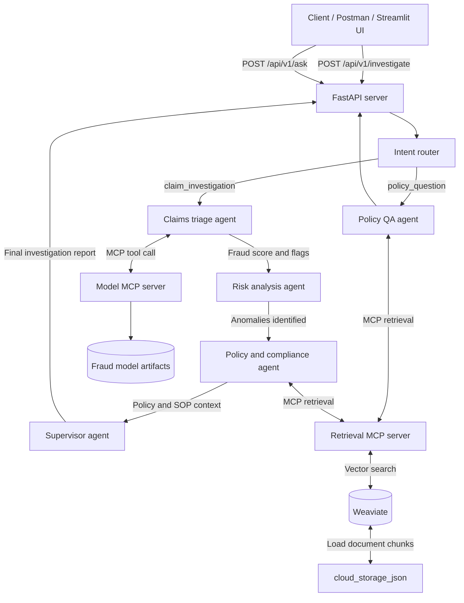

# Agentic Insurance Fraud Risk and Investigation System

A multi-agent insurance workflow that combines a fraud-risk model, LangGraph orchestration, policy retrieval with Weaviate, MCP services, FastAPI, and a Streamlit investigation desk.

## Architecture and System Flow



## Prerequisites

- Python 3.10 or newer
- Docker and Docker Compose
- Ollama with the configured model available locally
- An Ollama model such as `llama3.1`

## Setup

From the project root:

```bash
python3 -m venv .venv
source .venv/bin/activate
python -m pip install --upgrade pip
python -m pip install -r requirements.txt
```

Start Weaviate:

```bash
docker compose up -d weaviate
```

Make sure Ollama is running and pull the default model if needed:

```bash
ollama serve
ollama pull llama3.1
```

Build and index the policy knowledge base:

```bash
python build_knowledge_base.py
python index_to_weaviate.py
```

## Run the Application

Open two terminals from the project root. Activate `.venv` in each terminal.

Terminal 1, start the API:

```bash
uvicorn api_server:app --host 0.0.0.0 --port 8001 --reload
```

Terminal 2, start the Streamlit UI:

```bash
streamlit run streamlit_app.py
```

Open the Streamlit URL shown in the terminal, usually `http://localhost:8501`. The API health endpoint is available at `http://localhost:8001/health`.

## Configuration

The following environment variables are optional:

```bash
export OLLAMA_HOST=http://localhost:11434
export OLLAMA_MODEL=llama3.1
export API_URL=http://localhost:8001
```

## Tests

With the virtual environment active:

```bash
python -m pytest tests
```

The `tests/` directory is ignored by Git in this local project. If it was previously tracked, remove it from the index while retaining the files locally:

```bash
git rm -r --cached tests/
```

Because `10.0.0.4` is a private VM address, Postman outside the VM cannot use it directly. I’ll outline the network exposure and the exact Streamable HTTP MCP requests Postman needs, using the already-tested `/mcp` endpoint.

Use the VM’s **public IP**, not `10.0.0.4`.

**1. Start MCP on the VM**

```bash
cd /home/ubuntu/Project1

/home/ubuntu/insurance_claims_model/venv/bin/python3 \
  -m fastmcp.cli run mcp_model_server.py \
  --transport http \
  --host 0.0.0.0 \
  --port 8011 \
  --no-banner
```

**2. Open port `8011`**

Allow inbound TCP `8011` in:

- VM/cloud security group
- VM firewall, if enabled

For Ubuntu firewall:

```bash
sudo ufw allow 8011/tcp
```

Your endpoint will be:

```text
http://100.61.142.64:8011/mcp
```

**3. In Postman, create a POST request**

URL:

```text
http://100.61.142.64:8011/mcp
```

Headers:

```text
Content-Type: application/json
Accept: application/json, text/event-stream
```

Body → raw → JSON:

```json
{
  "jsonrpc": "2.0",
  "id": 1,
  "method": "initialize",
  "params": {
    "protocolVersion": "2025-06-18",
    "capabilities": {},
    "clientInfo": {
      "name": "Postman",
      "version": "1.0"
    }
  }
}
```

Send it. Copy the `mcp-session-id` response header from Postman.

**4. List available tools**

Create another POST request to the same URL with:

```text
Content-Type: application/json
Accept: application/json, text/event-stream
Mcp-Session-Id: <SESSION_ID>
```

Body:

```json
{
  "jsonrpc": "2.0",
  "id": 2,
  "method": "tools/list"
}
```

You should see `health_check`, `lookup_policy`, and `score_claim`.

**5. Check MCP health**

Use the same headers and body:

```json
{
  "jsonrpc": "2.0",
  "id": 3,
  "method": "tools/call",
  "params": {
    "name": "health_check",
    "arguments": {}
  }
}
```

Expected result includes:

```json
{
  "status": "ok",
  "server": "Insurance Unified MCP"
}
```

**6. Score a claim**

Use the same headers and body:

```json
{
  "jsonrpc": "2.0",
  "id": 4,
  "method": "tools/call",
  "params": {
    "name": "score_claim",
    "arguments": {
      "claim": {
        "claim_id": "CLM-POSTMAN-001",
        "claim_amount": 12500.0,
        "claim_type": "Outpatient",
        "procedure_code": "AA395",
        "provider_specialty": "General Practice",
        "patient_age": 45,
        "patient_income": 35000.0,
        "patient_id": "P-1001",
        "provider_id": "PRV-201",
        "claim_status": "Submitted",
        "diagnosis_code": "D001",
        "provider_location": "Urban",
        "claim_submission_method": "Electronic"
      }
    }
  }
}
```

Expected result:

```json
{
  "claim_id": "CLM-POSTMAN-001",
  "risk_level": "HIGH_RISK",
  "risk_score": 0.8819,
  "decision_cutoff": 0.5,
  "triage_status": "..."
}
```

If Postman cannot connect, verify the public IP, cloud security-group rule, VM firewall, and that the server is listening on `0.0.0.0:8011`.